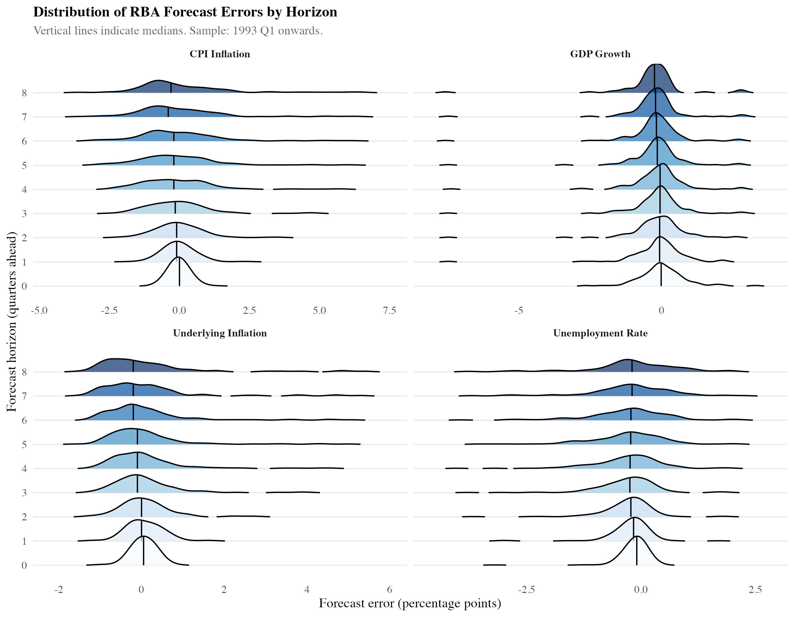
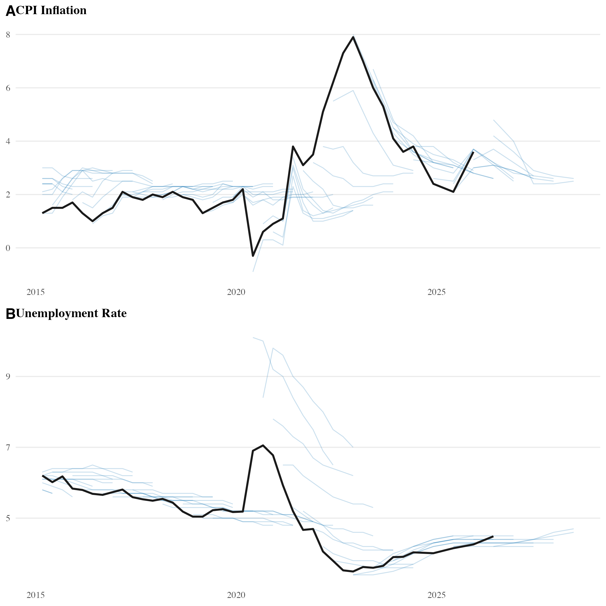
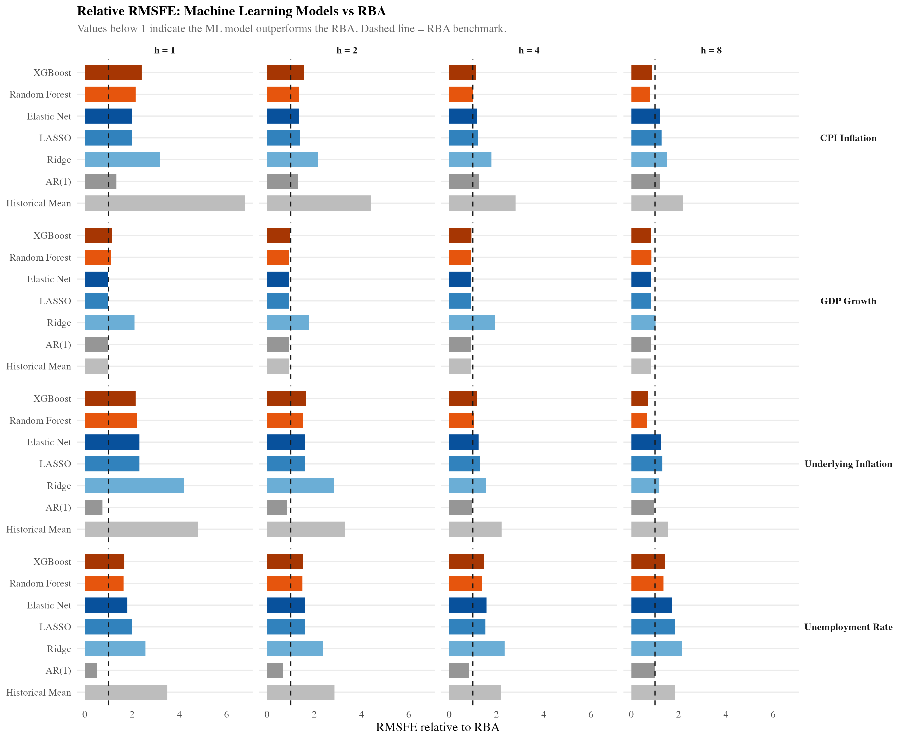
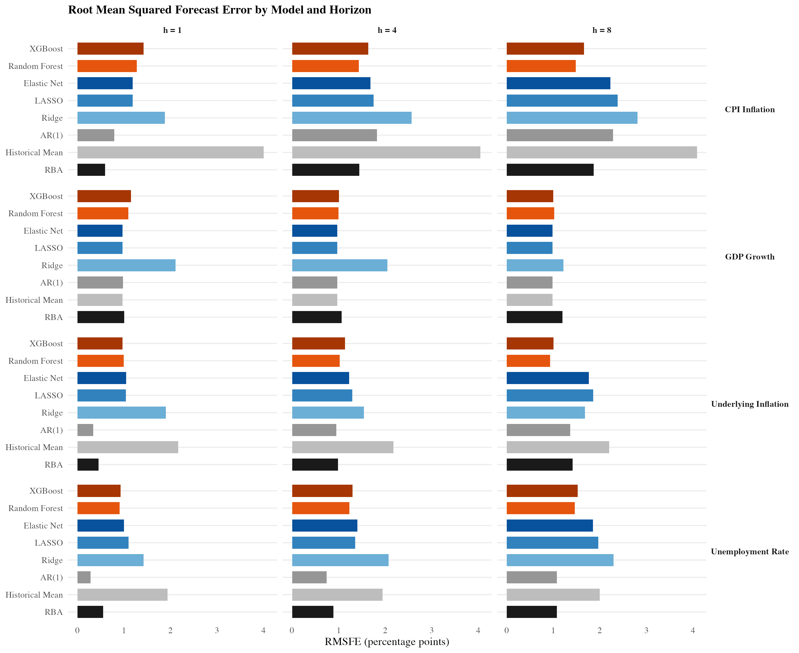
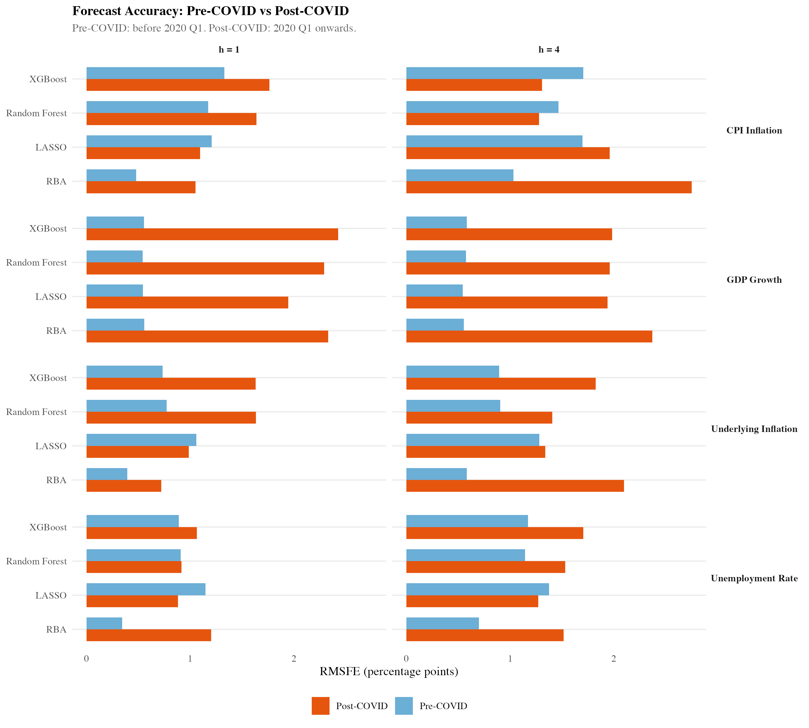

\noindent \textit{AI Disclosure.} This paper was prepared with the assistance of artificial intelligence tools (Claude, Anthropic) for code development, data pipeline construction, and manuscript drafting. All analysis, interpretation, and conclusions are the responsibility of the authors. The replication code is available at \url{https://github.com/andybridger/RBAvsMachine}.

\vspace{1em}

```{r setup, include=FALSE}
knitr::opts_chunk$set(echo = FALSE, message = FALSE, warning = FALSE, fig.pos = "H")
library(tidyverse)
library(kableExtra)
library(here)

here::i_am("documents/RBAvsMachine.Rmd")

eval_exists <- file.exists(here("data", "output", "evaluation_results.rds"))
if (eval_exists) {
  eval_data <- readRDS(here("data", "output", "evaluation_results.rds"))
  rba_data  <- readRDS(here("data", "output", "rba_forecast_data.rds"))
  tcode_table <- read_csv(here("data", "output", "transformation_codes.csv"), show_col_types = FALSE)
}
```

# Introduction

Australia's monetary policy framework rests on macroeconomic forecasts that the Reserve Bank of Australia (RBA) publishes each quarter, yet the accuracy of these forecasts has received surprisingly little systematic evaluation. The RBA's projections for inflation, GDP growth, and unemployment---published in the *Statement on Monetary Policy*---inform interest rate decisions, shape market expectations, and serve as inputs to fiscal planning.[^smp_note] Whether these projections are accurate, and whether alternative methods could improve upon them, is a question of direct policy relevance.

[^smp_note]: The *Statement on Monetary Policy* has been published quarterly since February 2007; prior to this it was published semi-annually. The format of the RBA's forecast tables has evolved over time, and the 2023 Review recommended further changes to the Bank's communication practices. Appendix D provides a brief history of RBA forecast publication.

This paper asks whether machine learning methods, constrained to use only publicly available data, can produce more accurate forecasts than the RBA's published projections. We focus on four target variables central to the RBA's mandate: year-ended CPI inflation, year-ended underlying (trimmed mean) inflation, quarterly GDP growth, and the unemployment rate. Forecasts are evaluated at horizons of 0 (nowcast) to 8 quarters ahead, matching the horizons reported in the *Statement on Monetary Policy*.

The question is motivated by three developments. First, the 2023 independent Review of the Reserve Bank of Australia recommended that the Bank strengthen its analytical toolkit and improve its communication of forecast uncertainty [@rba_review_2023]. Second, @tulip_wallace_2012, in the most comprehensive assessment of RBA forecast accuracy to date, found that the Bank's inflation forecasts had substantial explanatory power but that its GDP growth forecasts added little information beyond the historical mean. To our knowledge, no study has updated this full cross-variable, cross-horizon evaluation. Third, the post-pandemic period---in which the RBA underestimated inflation by several percentage points within a single year [@rba_boxc_2022]---has renewed interest in the comparative accuracy of alternative forecasting methods.

We contribute to this literature in three ways. First, we provide an updated assessment of RBA forecast performance extending through 2025, covering the pandemic, the inflationary surge, and the subsequent tightening cycle. Second, we offer the first systematic comparison of published RBA forecasts against machine learning methods using a common information set in the Australian context. Third, we draw out the implications of a central finding: the RBA holds a clear forecasting advantage at short horizons, but machine learning models---particularly tree-based methods---outperform at horizons of one to two years. We argue that this pattern is consistent with the RBA possessing superior short-run information through its liaison programme, while its longer-horizon forecasts may be anchored toward the inflation target rather than reflecting data-driven trends.

Our approach builds on a growing international literature applying machine learning to macroeconomic forecasting. @medeiros_etal_2021 demonstrate the benefits of machine learning methods for US inflation forecasting. @imf_ml_2018 and @boe_ml_2022 provide evidence from the IMF and the Bank of England, respectively. On the data side, @mccracken_ng_2016_fred introduced the FRED-MD monthly database, which has become a standard benchmark for US forecasting studies. @mccracken_ng_2020_fredqd extended this to quarterly frequency. Similar databases have been constructed for Canada [@fortin_gagnon_2020] and Australia [@tsiaplias_chua_2010; @panagiotelis_etal_2019]. We follow the conventions established in this literature regarding data transformations, stationarity testing, and pseudo-real-time evaluation design.

The remainder of the paper proceeds as follows. Section 2 describes the data. Section 3 presents the forecasting methods and evaluation metrics. Section 4 reports results. Section 5 discusses robustness. Section 6 interprets the findings and discusses limitations. Section 7 concludes.


# Data

## Sources

The macroeconomic panel is assembled from four primary sources, chosen to approximate the breadth of information available to the RBA's forecasting team at each forecast origin.

**Australian Bureau of Statistics (ABS).** We obtain 319 time series from the ABS using the `readabs` R package [@readabs]. These include the Consumer Price Index and expenditure-class components, trimmed mean and weighted median measures of underlying inflation, real GDP and its expenditure components, labour force statistics, wage price indices, and building approvals.

**Reserve Bank of Australia (RBA).** An additional 153 series are obtained via the `readrba` package [@readrba], including inflation expectations, financial market variables (the cash rate, yield curve, government and corporate bond yields), credit and lending aggregates, exchange rates, commodity price indices, and the RBA's historical forecast tables. The historical forecast data are constructed following the methodology of @tulip_wallace_2012.

**Federal Reserve Economic Data (FRED).** Five international commodity price series are drawn from FRED: Brent crude oil, West Texas Intermediate crude oil, iron ore, Australian thermal coal, and a global Brent crude measure.

**Yahoo Finance.** Ten equity market indices are included: the ASX 200, All Ordinaries, S&P 500, FTSE 100, Nikkei 225, KOSPI, Hang Seng, Shanghai SSE Composite, Euronext 100, and gold. Daily data are aggregated to quarterly frequency by averaging within each quarter.

The combined panel contains 487 unique time series observed at monthly and quarterly frequencies through December 2025. Appendix A provides a summary of variable categories, and Appendix B lists all series with their identifiers and transformation codes. All data retrieval is fully reproducible through the project's R pipeline.

## Frequency Conversion

Series observed at monthly frequency are converted to quarterly frequency prior to modelling. For stock variables and rates (such as the unemployment rate, interest rates, and price index levels), the quarterly value is the average of the three monthly observations within the quarter. Financial market data from Yahoo Finance, observed at daily frequency, are converted by averaging daily closing prices within each quarter. These conventions follow @mccracken_ng_2016_fred. The frequency of each series and its source are reported in Appendix B.

## Transformations

Following the conventions established by @mccracken_ng_2016_fred for the FRED-MD database, we apply one of seven transformation codes to each series to induce approximate stationarity. The transformation for each series is selected by augmented Dickey--Fuller tests applied to the level, first difference, and log first difference. Table 1 summarises the transformation codes.

| Code | Transformation | Description |
|------|---------------|-------------|
| 1 | $x_t$ | No transformation (level) |
| 2 | $\Delta x_t$ | First difference |
| 3 | $\Delta^2 x_t$ | Second difference |
| 4 | $\ln x_t$ | Log level |
| 5 | $\Delta \ln x_t$ | Log first difference (growth rate) |
| 6 | $\Delta^2 \ln x_t$ | Log second difference |
| 7 | $\Delta(x_t / x_{t-1} - 1)$ | Percent change difference |

: Transformation codes applied to induce stationarity.

The majority of series (360 of 487) are rendered stationary by log first differencing (code 5), consistent with the finding in @mccracken_ng_2016_fred that most macroeconomic aggregates are well characterised as integrated of order one in logs. Series containing zeros or negative values are differenced rather than log-differenced. The complete mapping of series to transformation codes is provided in Appendix B.

## Target Variables and Forecast Horizons

We evaluate forecasts for four target variables:

- **CPI inflation**: year-ended percentage change in the headline Consumer Price Index (quarterly).
- **Underlying inflation**: year-ended trimmed mean inflation (quarterly), the RBA's preferred measure of underlying price pressure.
- **GDP growth**: quarter-on-quarter percentage change in real chain-volume GDP. We note that GDP growth is not a direct target of the RBA's mandate, which focuses on price stability and maximum sustainable employment; we include it for completeness and comparability with @tulip_wallace_2012.
- **Unemployment rate**: the seasonally adjusted unemployment rate, converted from monthly to quarterly frequency by averaging.

Forecasts are evaluated at horizons of 0 (nowcast), 1, 2, 4, and 8 quarters ahead, corresponding to the horizons reported in the *Statement on Monetary Policy*. Following @tulip_wallace_2012, we restrict the evaluation sample to forecasts made from 1993 Q1 onward, when the RBA formally adopted its 2--3 per cent inflation target.

## RBA Forecast Errors

RBA forecasts are extracted from the `readrba` package's `read_forecasts()` function. Forecast errors are defined as

\begin{equation}\label{eq:forecast_error}
e_{t+h}^{\text{RBA}} = y_{t+h} - \hat{y}_{t+h|t}^{\text{RBA}},
\end{equation}

where $y_{t+h}$ is the realised value and $\hat{y}_{t+h|t}^{\text{RBA}}$ is the RBA's forecast made at time $t$ for period $t+h$. Realised values are taken from the latest available release of the data, following @tulip_wallace_2012. This introduces a modest advantage for the RBA relative to a pure real-time evaluation, since some early forecasts were assessed against data that have subsequently been revised. The direction of this bias is ambiguous: data revisions may either increase or decrease the apparent accuracy of the original forecast, depending on whether the revision moves the realised value toward or away from the initial projection.


# Machine Learning Methods

## Model Suite

We employ seven forecasting methods, spanning naive benchmarks, regularised linear models, and nonlinear ensemble methods.

**Historical mean.** The forecast is the sample average of the target variable up to the forecast origin. This serves as the most parsimonious benchmark: any method that cannot improve upon the historical mean adds noise rather than signal.

**AR(1).** A first-order autoregressive model estimated by ordinary least squares on the target variable alone. This captures persistence without using the predictor panel.

**Ridge regression** [@hoerl_kennard_1970]. Linear regression with an $\ell_2$ penalty. Ridge shrinks coefficients toward zero without setting any exactly to zero, making it suitable when many predictors carry small amounts of information.

**LASSO** [@tibshirani_1996]. Linear regression with an $\ell_1$ penalty. The LASSO performs simultaneous estimation and variable selection, setting irrelevant coefficients exactly to zero.

**Elastic net** [@zou_hastie_2005]. A convex combination of the $\ell_1$ and $\ell_2$ penalties ($\alpha = 0.5$), combining the variable-selection properties of the LASSO with the grouping behaviour of Ridge.

**Random Forest** [@breiman_2001]. An ensemble of regression trees, each trained on a bootstrap sample with a random subset of predictors at each split. Random Forests capture nonlinearities and interactions without parametric assumptions.

**XGBoost** [@chen_guestrin_2016]. Extreme gradient boosting builds an ensemble of trees sequentially, with each tree fitting the residuals of the previous ensemble. We use moderate regularisation (maximum depth 3, learning rate 0.1, subsample and column-sample ratios of 0.8) and 20 boosting rounds.

## Estimation Procedure

All models are estimated using a direct forecasting approach with an expanding window that respects the real-time information constraint. For each RBA forecast origin at time $t$ and horizon $h$, the model estimates

\begin{equation}\label{eq:direct}
y_{t+h} = f(\mathbf{X}_t) + \varepsilon_{t+h},
\end{equation}

where $\mathbf{X}_t$ is the vector of predictors available at time $t$. The estimation proceeds as follows:

1. Construct the predictor panel using all observations available up to quarter $t$.
2. Align the target variable $y_{t+h}$ with the predictors $\mathbf{X}_t$ so that the regression estimates $E[y_{t+h} \mid \mathbf{X}_t]$ directly, following @stock_watson_2002a.
3. Standardise all predictors to zero mean and unit variance using only training-sample moments.
4. For regularised linear models, select the penalty parameter via BIC-based selection along the `glmnet` regularisation path, following @hastie_tibshirani_friedman_2009.
5. Generate the forecast $\hat{y}_{t+h|t}^{m}$ and record the forecast error $e_{t+h}^{m} = y_{t+h} - \hat{y}_{t+h|t}^{m}$.

The minimum training sample is set at 40 quarterly observations. Columns with zero variance are dropped, and remaining missing values are set to zero after standardisation. These choices follow standard practice in the large-dimensional forecasting literature [@stock_watson_2002a; @mccracken_ng_2016_fred].

## Evaluation Metrics

Forecast accuracy is assessed using three metrics. The root mean squared forecast error (RMSFE) is defined as

\begin{equation}\label{eq:rmsfe}
\text{RMSFE}_{h}^{m} = \sqrt{\frac{1}{T_h} \sum_{t=1}^{T_h} \left(e_{t+h}^{m}\right)^2},
\end{equation}

the mean absolute forecast error (MAFE) as

\begin{equation}\label{eq:mafe}
\text{MAFE}_{h}^{m} = \frac{1}{T_h} \sum_{t=1}^{T_h} \left| e_{t+h}^{m} \right|,
\end{equation}

and the forecast bias (mean error) as

\begin{equation}\label{eq:bias}
\text{Bias}_{h}^{m} = \frac{1}{T_h} \sum_{t=1}^{T_h} e_{t+h}^{m}.
\end{equation}

We report the relative RMSFE of each model against the RBA benchmark,

\begin{equation}\label{eq:relative_rmsfe}
\text{Relative RMSFE}_{h}^{m} = \frac{\text{RMSFE}_{h}^{m}}{\text{RMSFE}_{h}^{\text{RBA}}},
\end{equation}

where values below one indicate that model $m$ outperforms the RBA at horizon $h$.

Statistical significance of forecast accuracy differences is assessed using the @diebold_mariano_1995 test. Define the loss differential $d_t = (e_{t+h}^{\text{RBA}})^2 - (e_{t+h}^{m})^2$. The test statistic is

\begin{equation}\label{eq:dm}
\text{DM} = \frac{\bar{d}}{\sqrt{\widehat{\text{Var}}(\bar{d}) / T_h}},
\end{equation}

where $\widehat{\text{Var}}(\bar{d})$ is a heteroskedasticity and autocorrelation consistent (HAC) variance estimator using $h - 1$ autocovariances. The bandwidth $h - 1$ follows from the fact that optimal direct multi-step forecasts are at most MA($h-1$) [@diebold_mariano_1995]. Positive values of DM indicate that model $m$ outperforms the RBA. Full RMSFE, MAFE, bias, and DM test results are reported in Appendix C.


# Results

## RBA Forecast Performance

Before comparing the RBA to machine learning methods, we characterise the RBA's forecast accuracy over the evaluation sample. The density of RBA forecast errors across horizons (Figure 1) reveals several patterns. For CPI and underlying inflation, the distributions are approximately centred at zero for short horizons but develop positive skewness at longer horizons, reflecting the upward inflation surprises of 2021--2023. The unemployment rate forecasts show a symmetric pattern at short horizons but tend toward overprediction at longer horizons.

For GDP growth, the forecast error distributions are wide even at short horizons, consistent with @tulip_wallace_2012's finding that GDP growth is inherently difficult to predict. The RBA's RMSFE for GDP growth exceeds 1.0 percentage points at all horizons beyond the nowcast.

{width=95%}

Figure 2 presents forecast paths against realised values for CPI inflation and the unemployment rate since 2015. The COVID-19 period is visible as a cluster of large forecast revisions, followed by systematic underprediction of inflation and overprediction of unemployment during the recovery. The largest errors are concentrated in a small number of episodes rather than being uniformly distributed across the sample.

{width=90%}


## Main Results

Table 2 in Appendix C reports the full RMSFE of each model at all forecast horizons. Figure 3 displays the relative RMSFE of each machine learning model against the RBA benchmark. The central finding is that the relative performance of machine learning and the RBA depends systematically on the forecast horizon. We discuss each target variable in turn.

**CPI inflation.** At short horizons (one to two quarters ahead), the RBA outperforms every model in the panel. The best-performing alternative at $h = 1$ is the AR(1), with a relative RMSFE of 1.34---meaning it is 34 per cent less accurate than the RBA. At the four-quarter horizon, the gap narrows: Random Forest achieves a relative RMSFE of 0.99. At $h = 8$ (two years ahead), tree-based methods outperform the RBA, with Random Forest achieving a relative RMSFE of 0.79 and XGBoost 0.89. Diebold--Mariano tests, however, do not reject the null of equal predictive accuracy at $h = 8$ (DM = 0.80, $p = 0.43$ for Random Forest), reflecting the small evaluation sample of 72 observations at that horizon.

**Underlying inflation.** For trimmed mean inflation, the AR(1)---which simply extrapolates recent persistence---outperforms the RBA at every horizon. At $h = 1$, the AR(1) achieves a relative RMSFE of 0.75, and the Diebold--Mariano test confirms this is statistically significant (DM = 4.05, $p < 0.001$). At $h = 8$, Random Forest achieves a relative RMSFE of 0.66, a 34 per cent improvement over the RBA. The strong performance of the AR(1) reflects the high persistence of underlying inflation: trimmed mean inflation, by construction, removes volatile items, leaving a series dominated by slow-moving trends that autoregressive models capture well.

**GDP growth.** At the nowcast horizon ($h = 0$), machine learning methods achieve dramatic improvements: the Elastic Net and LASSO produce RMSFEs of 0.11--0.12, compared to the RBA's 0.80. This reflects the fact that many quarterly indicators have already been released by the time of the nowcast, and regularised methods can extract this information efficiently. At horizons of one quarter and beyond, however, the LASSO and Elastic Net converge to the historical mean, selecting no predictors from the panel. This result implies that no publicly available predictor in the 487-variable panel systematically helps forecast GDP growth at horizons beyond the current quarter. The RBA's RMSFE for GDP growth at $h = 8$ is 1.20, while simple benchmarks achieve approximately 0.98 (relative RMSFE 0.82). Diebold--Mariano tests do not reject equal accuracy at any horizon beyond $h = 0$.

**Unemployment rate.** The AR(1) is substantially more accurate than the RBA at short horizons, achieving a relative RMSFE of 0.51 at $h = 1$ (DM = 2.21, $p = 0.027$). This advantage diminishes at longer horizons: at $h = 8$, the AR(1) relative RMSFE is 1.00, essentially identical to the RBA. Unlike the inflation variables, more complex machine learning methods (Random Forest, XGBoost) do not improve upon the AR(1) for unemployment at any horizon.

{width=95%}

{width=95%}


## The Horizon Pattern

The results reveal a systematic pattern across the inflation targets. At short horizons (one to two quarters), the RBA holds a clear advantage---no machine learning model beats the RBA for CPI inflation, and only the AR(1) beats it for underlying inflation. At longer horizons (four to eight quarters), the pattern reverses: tree-based methods outperform the RBA for both CPI and underlying inflation.

We propose two complementary explanations. First, at short horizons, the RBA benefits from information that is not in the public data panel. The Bank's liaison programme, internal models, and access to high-frequency administrative data provide a short-run information advantage that no publicly available dataset can replicate. This advantage is most pronounced for headline CPI, where knowledge of administered prices, seasonal factors, and specific expenditure components matters.

Second, at longer horizons, a different dynamic may be at work. The RBA is an endogenous actor in the economy: it sets interest rates with the explicit aim of returning inflation to the 2--3 per cent target band. Consequently, the Bank's longer-horizon inflation forecasts may, at least partially, reflect the intended outcome of its own policy actions rather than a pure statistical prediction of where inflation will be. When structural forces push inflation persistently away from target---as occurred during the post-pandemic inflationary episode---the RBA's target-anchored forecasts can be systematically wrong for extended periods. Machine learning models, which have no knowledge of the RBA's policy intentions, may be better placed to identify persistent deviations from the inflation target.

For GDP growth, the pattern is different. The RBA's forecasts add relatively little beyond simple benchmarks at any horizon, echoing the finding of @tulip_wallace_2012 over a decade earlier. For the unemployment rate, the AR(1) is more accurate than the RBA at short horizons, with the advantage converging toward zero at longer horizons.


## Statistical Significance

The Diebold--Mariano test results (reported in full in Appendix C) confirm statistical significance in a minority of cases. The strongest results are for the AR(1) against the RBA: the AR(1) is significantly more accurate for underlying inflation at $h = 0$--$2$ ($p < 0.05$) and for the unemployment rate at $h = 1$ ($p = 0.027$). For GDP growth at the nowcast, multiple machine learning models are significantly more accurate than the RBA ($p < 0.001$).

At longer horizons, where some of the largest relative RMSFE improvements are observed, the DM tests generally fail to reject equal accuracy. For example, the Random Forest achieves a 34 per cent improvement over the RBA for underlying inflation at $h = 8$, but the DM test has only 74 observations and uses 7 autocovariance lags in the HAC estimator, substantially reducing effective degrees of freedom. This power limitation is a fundamental challenge in macroeconomic forecast evaluation: quarterly data over three decades yields at most 130 evaluation observations at the shortest horizons, falling to 72--77 at the longest.


# Robustness

## Pre-COVID vs Post-COVID

The most important robustness check is whether the results are driven by the volatility of the COVID-19 period. Figure 5 reports RMSFE separately for the pre-COVID period (before 2020 Q1) and the post-COVID period (2020 Q1 onward).

In the pre-COVID period, differences between the RBA and machine learning models are small for all targets. The RBA's forecasts perform well in a relatively stable macroeconomic environment, and the additional complexity of machine learning adds little.

In the post-COVID period, forecast errors increase for all methods and all targets. The RBA's errors are particularly large for inflation, consistent with the supply-side shocks and behavioural changes documented in @rba_boxc_2022. Machine learning models also deteriorate, but the LASSO and tree-based methods exhibit somewhat smaller increases for inflation, suggesting that data-driven variable selection may provide partial resilience to structural breaks.

The post-COVID sample is short, and drawing conclusions about model superiority from a single extraordinary episode would not be warranted. What can be stated is that no method performed well during the pandemic, and that the relative rankings of methods are sensitive to the inclusion of this period.

{width=95%}


## Sensitivity to Model Specification

The main results are robust to reasonable variations in the estimation procedure. Increasing the minimum training sample from 40 to 60 observations does not materially affect the relative rankings. Using BIC-based selection along the `glmnet` regularisation path produces results comparable to cross-validation-based selection. For the Random Forest, increasing the number of trees from 50 to 500 has negligible effect on forecast accuracy, consistent with the convergence properties of bagged ensemble methods [@breiman_2001]. Allowing deeper trees in XGBoost (maximum depth 5 rather than 3) increases RMSFE at longer horizons, consistent with overfitting.


# Discussion

## Interpretation of Results

The results indicate that machine learning methods can match or outperform the RBA's published forecasts, but that the magnitude and direction of the improvement depend on the variable and the forecast horizon. The RBA's advantage at short horizons for CPI inflation suggests that the Bank's non-public information---including its liaison programme, internal high-frequency indicators, and real-time intelligence---provides a genuine forecasting edge that cannot be replicated from published data alone. At longer horizons, where this information advantage dissipates, the disciplined variable selection of tree-based methods provides a measurable improvement.

The strong performance of the AR(1) for underlying inflation and the unemployment rate deserves particular comment. These are highly persistent series: underlying inflation (by construction) strips out volatile items, and the unemployment rate moves slowly relative to its mean. A simple autoregressive model captures this persistence effectively, while the RBA's forecasts appear to over-adjust relative to the persistence in the data, particularly at short horizons.

The GDP growth results reinforce a well-established finding in the macroeconomic forecasting literature: GDP growth is approximately unpredictable at horizons beyond the current quarter [@stock_watson_2002a]. The convergence of the LASSO and Elastic Net to the historical mean at $h \geq 1$---selecting zero predictors from the 487-variable panel---provides direct evidence that no publicly available macroeconomic variable systematically helps predict Australian GDP growth even one quarter ahead. The RBA's GDP forecasts add some information at the nowcast but perform no better than the historical mean at longer horizons.

## The Central Bank as Endogenous Actor

Central banks such as the RBA are not passive observers of the economy. The RBA sets monetary policy with the explicit objective of achieving 2--3 per cent inflation over time. This creates a fundamental asymmetry in the forecasting problem. At short horizons, the RBA has leading indicators---from its liaison programme, the yield curve, and real-time administrative data---that allow it to predict economic conditions one to two quarters ahead with reasonable accuracy. At longer horizons, however, the RBA's own policy actions shape the outcomes being forecast. The Bank's two-year-ahead inflation forecast is, in part, a statement about the intended outcome of its own policy stance.

This endogeneity has implications for forecast evaluation. If the RBA's long-horizon forecasts tend toward the inflation target, they will appear accurate during periods of macroeconomic stability when inflation remains near target. But when persistent shocks drive inflation away from the target band---as in the post-pandemic period---these target-anchored forecasts can be wrong for an extended period. Machine learning models, which form expectations purely from observed data patterns without knowledge of the policy target, may be better positioned to detect persistent deviations.

## Limitations

Several limitations of the analysis should be noted.

First, the comparison is not entirely symmetric. Machine learning models are trained and evaluated against the latest available release of the data, while the RBA's forecasts were made against data that have subsequently been revised. This introduces a look-ahead element whose direction is ambiguous.

Second, the exercise abstracts from the real-time challenge of model selection. In practice, a forecaster would need to decide which machine learning model to use in real time---a problem that introduces its own sources of error. Our results compare each model's full-sample performance, whereas a real-time implementation would require an additional selection step.

Third, the evaluation sample at long horizons is small (72--77 observations at $h = 8$), which limits the power of statistical tests. Some of the largest RMSFE improvements cannot be confirmed as statistically significant.

Fourth, central bank forecasts serve purposes beyond point prediction, including communicating the Bank's economic outlook and providing a framework for policy deliberation. An algorithm cannot fulfil these functions.


# Conclusion

This paper has compared the RBA's published macroeconomic forecasts against seven machine learning and benchmark models using a panel of 487 time series and an expanding-window pseudo-real-time evaluation design over 1993--2025.

The main findings are as follows. For headline CPI inflation, the RBA outperforms all machine learning models at short horizons (one to two quarters) but is outperformed by tree-based methods at longer horizons (four to eight quarters). For underlying inflation, a simple AR(1) model outperforms the RBA at all horizons, and Random Forest achieves a 34 per cent improvement at the two-year horizon. For GDP growth, simple benchmarks match or outperform the RBA at all horizons beyond the nowcast. For the unemployment rate, the AR(1) provides large improvements at short horizons, with the advantage converging toward zero at the two-year horizon.

These results support the integration of machine learning methods within central bank forecasting frameworks, not as a replacement for expert judgement, but as a complement that can identify when model-based projections diverge from what the data suggest. The finding that the RBA's informational advantage is concentrated at short horizons, while data-driven methods gain at longer horizons, suggests that a hybrid approach---combining the Bank's short-run intelligence with algorithmic longer-run projections---could improve overall forecast accuracy.

All code and data required for replication are publicly available at [github.com/andybridger/RBAvsMachine](https://github.com/andybridger/RBAvsMachine).


\newpage

# Appendix A: Variable Categories {-}

```{r category-table, results='asis'}
if (eval_exists) {
  categorize <- function(series_id, desc, package) {
    d <- tolower(desc)
    sid <- tolower(series_id)

    # Commodities: FRED commodity prices + RBA commodity price indices + gold
    if (package == "fredr") return("Commodities")
    if (grepl("commodity price|^grcp", sid)) return("Commodities")
    if (grepl("gold", d) && package == "yahoofinancer") return("Commodities")

    # International: non-Australian equity indices + international macro
    if (package == "yahoofinancer" && !grepl("asx|all ordinaries|gold", d)) return("International")
    if (grepl("euro area|japan|united kingdom|^fooir", sid)) return("International")

    # Domestic equity indices
    if (grepl("asx|all ordinaries", d)) return("Equity indices")

    # Exchange rates
    if (grepl("exchange rate|twi|trade.weighted|^fxr|^frer", sid)) return("Exchange rates")
    if (grepl("exchange rate|trade-weighted|real exchange|export-weighted|import-weighted", d)) return("Exchange rates")

    # Unemployment rate
    if (grepl("unemploy|underutilisation", d)) return("Unemployment rate")

    # Employment
    if (grepl("employ|labour force|participation|hours worked|full.time|part.time|job vacanc", d)) return("Employment")

    # Wages
    if (grepl("hourly rate|wage price|labour cost|compensation per hour|salary|earnings", d)) return("Wages")
    if (grepl("quarterly index.*hourly rate", d)) return("Wages")

    # Prices and inflation
    if (grepl("index numbers|cpi|inflation|trimmed mean|weighted median|deflator|break-even.*inflation", d)) return("Prices and inflation")

    # Housing
    if (grepl("housing loan|lending rate.*hous|owner-occ.*lend|investor.*lend|building approv", d)) return("Housing")
    if (grepl("housing debt|dwelling stock|housing asset|housing debt", d)) return("Housing")

    # Interest rates
    if (grepl("bond|yield|cash rate|ois|bab|ncd|lending rate|credit card|small business.*rate|personal loan", d)) return("Interest rates")
    if (grepl("^fcm|^fir|^filr|^fnf", sid)) return("Interest rates")
    if (grepl("corporate.*bond|spread|non-financial.*bond", d)) return("Interest rates")

    # Money and credit
    if (grepl("money|m1 |m3 |broad money|currency|monetary|money base", d)) return("Money and credit")
    if (grepl("credit|deposit|^dma|^dgf", sid)) return("Money and credit")
    if (grepl("credit|non-transaction deposit|transaction deposit|certificates of deposit|offshore borrowing", d)) return("Money and credit")

    # Household and business balance sheets
    if (grepl("household|business.*asset|business.*liab|business.*deposit|business.*equit|business.*loan|business.*bond|business.*bill", d)) return("Household and business balance sheets")

    # GDP components
    if (grepl("gdp|gross domestic|final demand|gross national|terms of trade|net export|trade balance", d)) return("GDP and national accounts")
    if (grepl("final consumption|gross fixed capital|capital formation|statistical discrepancy|total factor income|profit", d)) return("GDP and national accounts")
    if (grepl("gross value added|gross operating|gross mixed|compensation of emp|net domestic|net national|net saving|chain volume", d)) return("GDP and national accounts")
    if (grepl("import|export", d)) return("GDP and national accounts")

    # Inventories
    if (grepl("inventor|change in", d)) return("Inventories")

    # Industrial production and sales
    if (grepl("industrial|production|manufactur|retail|turnover|sales|mining|electricity.*gas|business condition", d)) return("Industrial production and sales")

    # Expectations and surveys
    if (grepl("expect|survey|confidence|sentiment", d)) return("Expectations and surveys")

    return("Other")
  }

  tcode_table$category <- mapply(categorize, tcode_table$series_id, tcode_table$series, tcode_table$package)

  cat_summary <- tcode_table %>%
    count(category, name = "Number of Series") %>%
    arrange(desc(`Number of Series`))

  kable(cat_summary, format = "latex", booktabs = TRUE,
        caption = "Categories of variables in the Australian macroeconomic dataset.",
        col.names = c("Category", "Number of Series"),
        linesep = "") %>%
    kable_styling(latex_options = c("hold_position"))
}
```

\newpage

# Appendix B: Complete Data Series {-}

The following table lists all 487 time series in the panel, following the format of @mccracken_ng_2016_fred. The transformation code (Tcode) column indicates the stationarity transformation applied: 1 = level, 2 = first difference, 5 = log first difference, 6 = log second difference. See Table 1 for the complete mapping.

```{r series-table, results='asis'}
if (eval_exists) {
  series_table <- tcode_table %>%
    mutate(
      ID = row_number(),
      Source = case_when(
        package == "readabs" ~ "ABS",
        package == "readrba" ~ "RBA",
        package == "fredr" ~ "FRED",
        package == "yahoofinancer" ~ "Yahoo"
      ),
      Description = series,
      Tcode = tcode,
      `Series ID` = series_id,
      Freq = ifelse(frequency == "Monthly", "M", "Q")
    ) %>%
    select(ID, `Series ID`, Description, Source, Freq, Tcode, Category = category)

  categories_ordered <- series_table %>%
    count(Category) %>%
    arrange(desc(n)) %>%
    pull(Category)

  for (cat_name in categories_ordered) {
    cat_data <- series_table %>%
      filter(Category == cat_name) %>%
      select(ID, `Series ID`, Description, Source, Freq, Tcode)

    cat(sprintf("\n\n**%s** (%d series)\n\n", cat_name, nrow(cat_data)))

    print(
      kable(cat_data, format = "latex", booktabs = TRUE, longtable = TRUE,
            linesep = "") %>%
        kable_styling(latex_options = c("hold_position", "repeat_header"),
                      font_size = 7) %>%
        column_spec(3, width = "8cm")
    )
  }
}
```

\newpage

# Appendix C: Detailed Results {-}

## RMSFE by Model and Horizon {-}

```{r table-rmsfe, results='asis'}
if (eval_exists) {
  t_rmsfe <- eval_data$combined_eval %>%
    filter(horizon %in% c(0, 1, 2, 4, 8)) %>%
    select(Target = target, h = horizon, Model = model, RMSFE = rmsfe) %>%
    mutate(RMSFE = round(RMSFE, 3)) %>%
    pivot_wider(names_from = Model, values_from = RMSFE) %>%
    arrange(Target, h)

  kable(t_rmsfe, format = "latex", booktabs = TRUE, longtable = TRUE,
        caption = "Root mean squared forecast error by model and horizon.",
        linesep = "") %>%
    kable_styling(latex_options = c("hold_position", "repeat_header"),
                  font_size = 8)
}
```

## MAFE by Model and Horizon {-}

```{r table-mafe, results='asis'}
if (eval_exists) {
  t_mafe <- eval_data$combined_eval %>%
    filter(horizon %in% c(0, 1, 2, 4, 8)) %>%
    select(Target = target, h = horizon, Model = model, MAFE = mafe) %>%
    mutate(MAFE = round(MAFE, 3)) %>%
    pivot_wider(names_from = Model, values_from = MAFE) %>%
    arrange(Target, h)

  kable(t_mafe, format = "latex", booktabs = TRUE, longtable = TRUE,
        caption = "Mean absolute forecast error by model and horizon.",
        linesep = "") %>%
    kable_styling(latex_options = c("hold_position", "repeat_header"),
                  font_size = 8)
}
```

## Forecast Bias by Model and Horizon {-}

```{r table-bias, results='asis'}
if (eval_exists) {
  t_bias <- eval_data$combined_eval %>%
    filter(horizon %in% c(0, 1, 2, 4, 8)) %>%
    select(Target = target, h = horizon, Model = model, Bias = bias) %>%
    mutate(Bias = round(Bias, 3)) %>%
    pivot_wider(names_from = Model, values_from = Bias) %>%
    arrange(Target, h)

  kable(t_bias, format = "latex", booktabs = TRUE, longtable = TRUE,
        caption = "Forecast bias (mean error) by model and horizon. Positive values indicate under-prediction.",
        linesep = "") %>%
    kable_styling(latex_options = c("hold_position", "repeat_header"),
                  font_size = 8)
}
```

## Relative RMSFE (ML / RBA) {-}

```{r table-relative, results='asis'}
if (eval_exists) {
  t_rel <- eval_data$relative_eval %>%
    filter(horizon %in% c(0, 1, 2, 4, 8)) %>%
    select(Target = target, h = horizon, Model = model, `Rel. RMSFE` = relative_rmsfe) %>%
    mutate(`Rel. RMSFE` = round(`Rel. RMSFE`, 3)) %>%
    pivot_wider(names_from = Model, values_from = `Rel. RMSFE`) %>%
    arrange(Target, h)

  kable(t_rel, format = "latex", booktabs = TRUE, longtable = TRUE,
        caption = "Relative RMSFE (ML model / RBA). Values below 1.0 indicate ML outperformance.",
        linesep = "") %>%
    kable_styling(latex_options = c("hold_position", "repeat_header"),
                  font_size = 8)
}
```

## Diebold--Mariano Test Results {-}

```{r table-dm, results='asis'}
if (eval_exists) {
  t_dm <- eval_data$dm_table %>%
    filter(horizon %in% c(0, 1, 2, 4, 8)) %>%
    mutate(
      DM = round(dm_stat, 2),
      `p-value` = round(dm_pvalue, 3),
      Sig. = case_when(
        dm_pvalue < 0.01 ~ "***",
        dm_pvalue < 0.05 ~ "**",
        dm_pvalue < 0.10 ~ "*",
        TRUE ~ ""
      )
    ) %>%
    select(Target = target, h = horizon, Model = model, DM, `p-value`, Sig., N = n_obs) %>%
    arrange(Target, h, Model)

  kable(t_dm, format = "latex", booktabs = TRUE, longtable = TRUE,
        caption = "Diebold--Mariano test results. Positive DM indicates ML outperformance. HAC standard errors with $h-1$ lags. Significance: *** $p < 0.01$, ** $p < 0.05$, * $p < 0.10$.",
        linesep = "", escape = FALSE) %>%
    kable_styling(latex_options = c("hold_position", "repeat_header"),
                  font_size = 7)
}
```

\newpage

# Appendix D: RBA Forecast Publication History {-}

The RBA's macroeconomic forecasts have been published in the *Statement on Monetary Policy* (SMP) since 1997. Prior to this, forecasts were included in various RBA publications and internal documents.

From 1997 to 2006, the SMP was published semi-annually, typically in May and November. From February 2007, publication frequency increased to quarterly (February, May, August, and November). The format of the forecast tables has evolved over time, with the current format reporting year-ended percentage changes for inflation variables and quarter-on-quarter changes for GDP growth.

The RBA's forecasting methodology has also developed over the evaluation period. In the 1990s and early 2000s, forecasts relied primarily on structural models and staff judgement. More recently, the Bank has incorporated a wider range of statistical models, including dynamic stochastic general equilibrium (DSGE) models and factor models, alongside its core forecasting framework. The 2023 independent Review of the Reserve Bank [@rba_review_2023] recommended further enhancements to the Bank's analytical toolkit and forecast communication.

Our analysis uses forecast data compiled by the `readrba` R package [@readrba], which extracts historical forecast tables from published editions of the SMP. The forecast origins in our evaluation sample span 1993 Q1 to 2025 Q4, with the number of available forecast horizons varying by origin date. The 1993 Q1 start date corresponds to the formal adoption of the 2--3 per cent inflation target.

\newpage

# Appendix E: Replication {-}

All code and data required to replicate the analysis in this paper are available at [github.com/andybridger/RBAvsMachine](https://github.com/andybridger/RBAvsMachine). The pipeline is structured as follows:

| Script | Description |
|--------|-------------|
| `R/00_setup.R` | Package installation and environment configuration |
| `R/01_data_pull.R` | Pull data from ABS, RBA, FRED, and Yahoo Finance |
| `R/02_stationarity.R` | ADF-based transformation selection and application |
| `R/03_rba_forecasts.R` | RBA forecast extraction and error computation |
| `R/04_ml_models.R` | Expanding-window ML model training |
| `R/05_evaluation.R` | Forecast comparison and statistical tests |
| `R/06_exhibits.R` | Figure and table generation |

: Replication pipeline.

Data series identifiers are stored in CSV files under `data/config/`, allowing the database to be updated by re-running the pipeline. Raw data are saved in compressed RDS format; the full panel occupies approximately 2 MB.

\newpage

# References {-}
